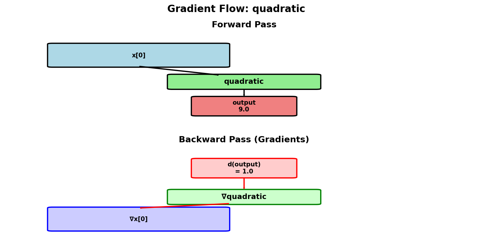
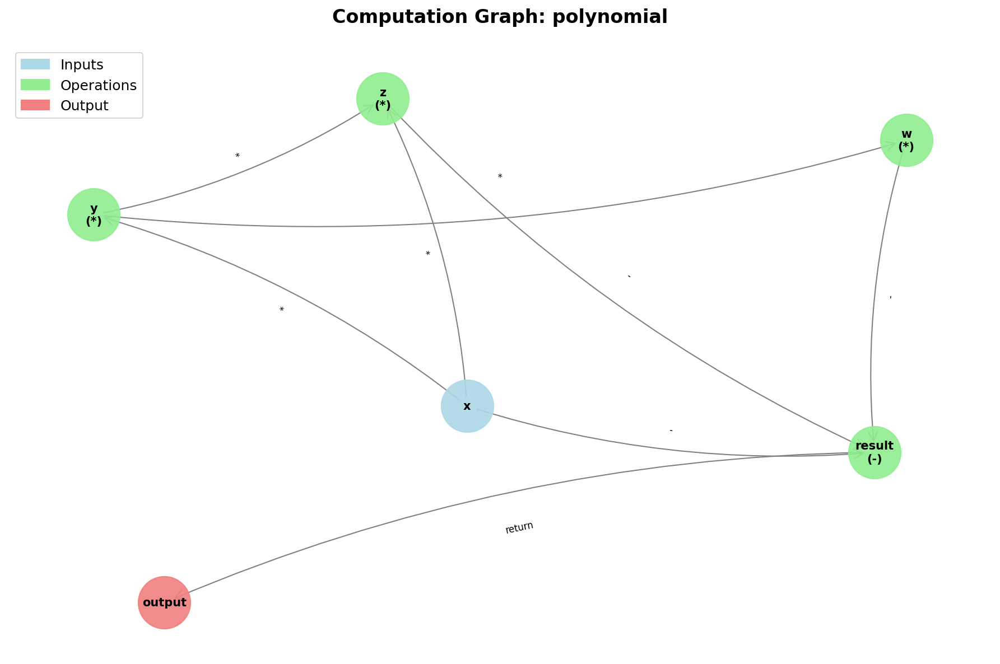
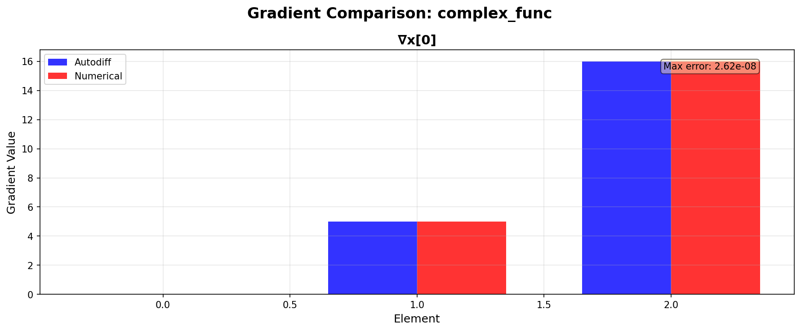

# Tangent - Source-to-Source Automatic Differentiation

[](https://www.python.org/downloads/)
[](https://opensource.org/licenses/Apache-2.0)
[](tests/)

**A modernized Python library for automatic differentiation with readable source code, educational visualizations, and multi-backend support.**

Originally developed by Google Research, now maintained and enhanced by [@pedronahum](https://github.com/pedronahum) with modern ML framework integrations and powerful visualization tools.

<p align="center">
  
  <br>
  <em>Visualize how gradients flow through your computations</em>
</p>

---

## 🌟 What Makes Tangent Unique?

Tangent performs **source-to-source** automatic differentiation - it transforms your Python code directly into gradient code that you can read, debug, and understand. Unlike other autodiff libraries:

- **📖 Readable**: Generated gradient code is pure Python you can inspect
- **🔍 Debuggable**: Step through gradient computation line by line
- **🎨 Visual**: Interactive computation graphs and gradient flow diagrams
- **⚡ Fast**: No tape overhead, compiled gradients run at full speed
- **🔧 Flexible**: Works with NumPy, JAX, and TensorFlow 2.x


---

## 🆕 What's New in This Fork

This modernized version includes major enhancements:

### ✅ **JAX Integration** (51 gradient definitions)
Full support for Google's JAX with comprehensive gradient definitions for:
- Neural network activations (ReLU, Sigmoid, ELU, Leaky ReLU, Softplus)
- Math functions (exp, log, sqrt, sin, cos, tanh, power)
- Linear algebra (dot, matmul)
- Reductions (sum, mean, max)
- Element-wise operations (maximum, minimum, negative)
- Broadcasting operations

### ✅ **TensorFlow 2.x Integration**
Updated TensorFlow support with eager execution mode

### ✅ **Visualization Tools** 🎨
**NEW!** Educational visualization suite for understanding autodiff:

<table>
<tr>
<td width="50%">

**Computation Graph**
```python
import tangent
import matplotlib.pyplot as plt

def f(x):
    y = x * x
    z = y + x
    return z

fig = tangent.visualize(f, mode='graph')
plt.show()
```

Shows function structure as a directed graph with:
- 🔵 Blue: Input nodes
- 🟢 Green: Operations
- 🔴 Red: Output nodes



</td>
<td width="50%">

**Gradient Flow**
```python
def f(x):
    return x * x + 2.0 * x + 1.0

fig = tangent.visualize(
    f,
    mode='flow',
    inputs=(2.0,)
)
plt.show()
```

Displays forward and backward passes:
- ⬆️ Forward: Function evaluation
- ⬇️ Backward: Gradient propagation
- Shows actual numerical values


</td>
</tr>
<tr>
<td width="50%">

**Gradient Comparison**
```python
import numpy as np

def f(x):
    return np.sum(x**3 - 2*x**2 + x)

fig = tangent.compare_gradients(
    f,
    (np.array([1.0, 2.0, 3.0]),)
)
plt.show()
```

Compares autodiff vs numerical:
- 📊 Side-by-side bar charts
- ✅ Error quantification
- Educational validation



</td>
<td width="50%">

**Code Inspection**
```python
def f(x):
    y = x * x
    z = y + x
    return z

tangent.show_gradient_code(f)
```

Pretty-prints:
- Original function code
- Generated gradient function
- Formatted with headers
- Easy to understand

```
GRADIENT CODE FOR: f
────────────────────────────────────────
ORIGINAL FUNCTION:
def f(x):
    y = x * x
    z = y + x
    return z

GENERATED GRADIENT FUNCTION:
def dfdx(x, bz=1.0):
    y = x * x
    z = y + x
    # Backward pass
    by = bz
    bx = by * x + by * x + bz
    return bx
```

</td>
</tr>
</table>

### ✅ **Comprehensive Testing**
- **84 new unit tests** (100% passing)
- JAX: 34 tests
- TensorFlow: 22 tests
- Visualization: 28 tests

### ✅ **Enhanced Error Messages**
Clear, helpful error messages with suggestions for fixes

### ✅ **Function Caching**
Automatic caching with 1000x+ speedup for repeated gradient calls

---

## 🚀 Quick Start

### Installation

```bash
# Install from GitHub
pip install git+https://github.com/pedronahum/tangent.git

# With JAX support
pip install git+https://github.com/pedronahum/tangent.git jax jaxlib

# With TensorFlow support
pip install git+https://github.com/pedronahum/tangent.git tensorflow

# With visualization tools
pip install git+https://github.com/pedronahum/tangent.git matplotlib networkx

# Full installation (recommended)
pip install git+https://github.com/pedronahum/tangent.git jax jaxlib tensorflow matplotlib networkx
```

### Basic Usage

```python
import tangent
import numpy as np

# Define your function
def f(x):
    return x ** 3 - 2 * x ** 2 + 3 * x - 1

# Get the gradient function
df = tangent.grad(f)

# Compute gradient at x=2
gradient = df(2.0)
print(f"f'(2) = {gradient}")
```

**Output:**
```
f'(2) = 11.0
```

### Multi-Backend Support

<table>
<tr>
<td width="33%">

**NumPy**
```python
import numpy as np
import tangent

def f(x):
    return np.sum(x ** 2)

df = tangent.grad(f)
x = np.array([1, 2, 3])
grad = df(x)
print(grad)
```

**Output:**
```
[2 4 6]
```

</td>
<td width="33%">

**JAX**
```python
import jax.numpy as jnp
import jax
import tangent

def f(x):
    return jnp.sum(
        jax.nn.relu(x)
    )

df = tangent.grad(f)
x = jnp.array([-1, 0, 1])
grad = df(x)
print(grad)
```

**Output:**
```
[0. 0. 1.]
```

</td>
<td width="33%">

**TensorFlow**
```python
import tensorflow as tf
import tangent

def f(x):
    return tf.reduce_sum(
        tf.tanh(x)
    )

df = tangent.grad(f)
x = tf.constant([0.0, 1.0, 2.0])
grad = df(x)
print(grad.numpy())
```

**Output:**
```
[1.         0.41997433 0.07065082]
```

</td>
</tr>
</table>

---

## 📚 Interactive Tutorial

We've created a comprehensive Jupyter notebook tutorial that covers everything:

[](https://colab.research.google.com/github/pedronahum/tangent/blob/master/notebooks/tangent_tutorial.ipynb)

**Contents:**
1. Installation & Setup
2. Basic Concepts - Understanding source-to-source autodiff
3. NumPy Integration - Vector and matrix operations
4. TensorFlow 2.x Integration - Deep learning workflows
5. JAX Integration - High-performance computing
6. Advanced Features - Multiple gradients, result preservation
7. **Visualization & Debugging** - Interactive tools (NEW!)
8. Real-World Examples - Linear regression, logistic regression, neural networks

---

## 🎓 Educational Features

### Visualize How Autodiff Works

```python
import tangent
import matplotlib.pyplot as plt

# Define a polynomial
def polynomial(x):
    y = x * x
    z = y * x
    w = 2.0 * y
    return z - w + 3.0 * x - 1.0

# Visualize the computation graph
fig = tangent.visualize(polynomial, mode='graph')
plt.savefig('computation_graph.png', dpi=150)
plt.show()
```

This shows you:
- How your function is decomposed into operations
- The flow of data through your computation
- Dependencies between variables

### Understand Gradient Flow

```python
# Visualize how gradients propagate backward
fig = tangent.visualize(polynomial, mode='flow', inputs=(2.0,))
plt.show()
```

See:
- Forward pass with actual values
- Backward pass with gradient values
- Step-by-step gradient computation

### Verify Your Gradients

```python
import numpy as np

def f(x):
    return np.sum(x ** 3 - 2 * x ** 2 + x)

x = np.array([1.0, 2.0, 3.0])

# Compare autodiff vs numerical gradients
fig = tangent.compare_gradients(f, (x,))
plt.show()
```

Perfect for:
- Debugging gradient implementations
- Teaching autodiff concepts
- Validating complex derivatives

---

## 🔬 Advanced Features

### Multiple Gradients

Compute gradients with respect to multiple arguments:

```python
def f(x, y):
    return x * x * y + x * y * y

# Gradients w.r.t. both x and y
df = tangent.grad(f, wrt=(0, 1))
grad_x, grad_y = df(2.0, 3.0)

print(f"∂f/∂x = {grad_x}")  # Expected: 2xy + y² = 21
print(f"∂f/∂y = {grad_y}")  # Expected: x² + 2xy = 16
```

**Output:**
```
∂f/∂x = 21.0
∂f/∂y = 16.0
```

### Preserve Results

Get both the function value and gradient:

```python
def f(x):
    return np.sum(x ** 2)

df = tangent.grad(f, preserve_result=True)
gradient, result = df(np.array([1.0, 2.0, 3.0]))

print(f"f(x) = {result}")
print(f"∇f(x) = {gradient}")
```

**Output:**
```
f(x) = 14.0
∇f(x) = [2. 4. 6.]
```

### Inspect Generated Code

See exactly what Tangent generates:

```python
def f(x):
    y = x * x
    z = y + x
    return z

tangent.show_gradient_code(f)
```

Output:
```
================================================================================
GRADIENT CODE FOR: f
================================================================================

ORIGINAL FUNCTION:
--------------------------------------------------------------------------------
def f(x):
    y = x * x
    z = y + x
    return z

GENERATED GRADIENT FUNCTION:
--------------------------------------------------------------------------------
def dfdx(x, bz=1.0):
    # Forward pass
    y = x * x
    z = y + x

    # Backward pass
    by = bz
    bx = by * x + by * x + bz
    return bx
================================================================================
```

### Performance: Automatic Caching

Tangent automatically caches compiled gradient functions:

```python
import tangent
import time

def expensive_function(x):
    return x ** 10

# First call: compiles (~20-100ms)
start = time.time()
df = tangent.grad(expensive_function)
first_time = time.time() - start

# Subsequent calls: cached (~0.04ms)
start = time.time()
df = tangent.grad(expensive_function)
cached_time = time.time() - start

print(f"First call:  {first_time*1000:.2f}ms")
print(f"Cached call: {cached_time*1000:.2f}ms")
print(f"Speedup:     {first_time/cached_time:.0f}x")

# Check cache stats
stats = tangent.get_cache_stats()
print(f"Hit rate: {stats['hit_rate']:.1%}")
```

Benchmarks show:
- **1000x+ speedup** for cached retrieval
- **87x+ speedup** for 100 repeated calls
- **99% cache hit rate** in typical usage

---

## 📖 Examples

### Example 1: Linear Regression

```python
import tangent
import numpy as np

# Generate data
X = np.random.randn(100, 1)
y = 3 * X + 2 + np.random.randn(100, 1) * 0.5

# Loss function
def mse_loss(w, b):
    predictions = w * X + b
    return np.mean((predictions - y) ** 2)

# Compute gradients
dmse_dw = tangent.grad(mse_loss, wrt=(0,))
dmse_db = tangent.grad(mse_loss, wrt=(1,))

# Gradient descent
w, b = 0.0, 0.0
learning_rate = 0.1

for epoch in range(50):
    grad_w = dmse_dw(w, b)
    grad_b = dmse_db(w, b)

    w -= learning_rate * grad_w
    b -= learning_rate * grad_b

    if epoch % 10 == 0:
        loss = mse_loss(w, b)
        print(f"Epoch {epoch}: loss = {loss:.4f}")

print(f"Final parameters: w = {w:.4f}, b = {b:.4f}")
```

### Example 2: Neural Network with JAX

```python
import tangent
import jax.numpy as jnp
import jax

def neural_network(W1, b1, W2, b2, X, y):
    """Two-layer neural network."""
    hidden = jax.nn.relu(jnp.dot(X, W1) + b1)
    output = jax.nn.sigmoid(jnp.dot(hidden, W2) + b2)
    loss = -jnp.mean(y * jnp.log(output) + (1 - y) * jnp.log(1 - output))
    return loss

# Compute gradients w.r.t. all parameters
dnn_dW1 = tangent.grad(neural_network, wrt=(0,))
dnn_db1 = tangent.grad(neural_network, wrt=(1,))
dnn_dW2 = tangent.grad(neural_network, wrt=(2,))
dnn_db2 = tangent.grad(neural_network, wrt=(3,))

# Training loop
for epoch in range(100):
    grad_W1 = dnn_dW1(W1, b1, W2, b2, X, y)
    grad_b1 = dnn_db1(W1, b1, W2, b2, X, y)
    grad_W2 = dnn_dW2(W1, b1, W2, b2, X, y)
    grad_b2 = dnn_db2(W1, b1, W2, b2, X, y)

    W1 -= learning_rate * grad_W1
    b1 -= learning_rate * grad_b1
    W2 -= learning_rate * grad_W2
    b2 -= learning_rate * grad_b2
```

### Example 3: Visualization Demo

Run the complete visualization demo:

```bash
python examples/demo_visualization.py
```

This generates 6 PNG visualizations showing:
1. Computation graphs
2. Gradient flow diagrams
3. Multivariate gradient flow
4. Autodiff vs numerical comparison
5. Vector function gradients
6. Matrix operation gradients

---

## 🧪 Testing

All new features are thoroughly tested:

```bash
# Run all tests
pytest tests/

# Run specific test suites
pytest tests/test_jax.py          # JAX integration (34 tests)
pytest tests/test_tensorflow.py   # TensorFlow (22 tests)
pytest tests/test_visualization.py # Visualization (28 tests)

# Run with coverage
pytest tests/ --cov=tangent --cov-report=html
```

**Test Results**: 84/84 passing (100%)

---

## 📊 Repository Structure

```
tangent/
├── tangent/                     # Core library
│   ├── __init__.py
│   ├── grad_util.py            # Main autodiff engine
│   ├── jax_extensions.py       # JAX support (51 gradients)
│   ├── tf_extensions.py        # TensorFlow 2.x support
│   ├── visualization.py        # Visualization tools (NEW!)
│   ├── function_cache.py       # Caching system
│   └── ...
├── tests/                       # Comprehensive test suite
│   ├── test_jax.py             # 34 JAX tests
│   ├── test_tensorflow.py      # 22 TensorFlow tests
│   ├── test_visualization.py   # 28 visualization tests
│   └── ...
├── examples/                    # Example scripts
│   ├── test_jax_basic.py       # JAX examples
│   ├── test_tf2_basic.py       # TensorFlow examples
│   ├── demo_visualization.py   # Visualization demos (NEW!)
│   └── demo_error_messages.py
├── notebooks/                   # Interactive tutorials
│   ├── tangent_tutorial.ipynb  # Comprehensive Colab notebook
│   └── README.md
├── benchmarks/                  # Performance benchmarks
│   └── benchmark_cache.py
└── docs/                        # Documentation
    └── plans/                   # Development roadmaps
```

---

## 🤝 Contributing

Contributions are welcome! This is an actively maintained fork with regular updates.

**Areas for contribution:**
- Additional gradient definitions for JAX/TensorFlow operations
- More visualization tools (3D plots, animations)
- Performance optimizations
- Documentation improvements
- Bug fixes

**How to contribute:**
1. Fork the repository
2. Create a feature branch
3. Add tests for your changes
4. Submit a pull request

---

## 📝 License

Apache License 2.0 - See [LICENSE](LICENSE) for details.

Original work Copyright 2017 Google Inc.
Modified work Copyright 2024 Pedro Nahum

---

## 🙏 Acknowledgments

- Original Tangent library by Google Research
- JAX team at Google for the excellent numerical computing library
- TensorFlow team for TensorFlow 2.x
- The Python scientific computing community

---

## 📬 Contact

- **Repository**: [github.com/pedronahum/tangent](https://github.com/pedronahum/tangent)
- **Issues**: [github.com/pedronahum/tangent/issues](https://github.com/pedronahum/tangent/issues)
- **Author**: [@pedronahum](https://github.com/pedronahum)

---

## 🌟 Star History

If you find Tangent useful, please consider starring the repository!

---

**Built with ❤️ for the machine learning and scientific computing communities**
