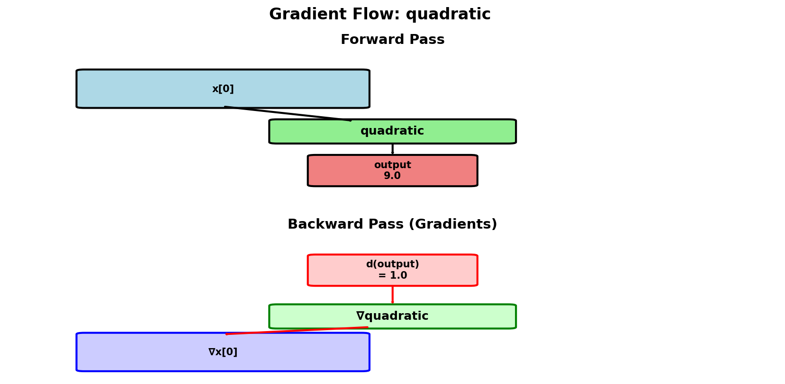
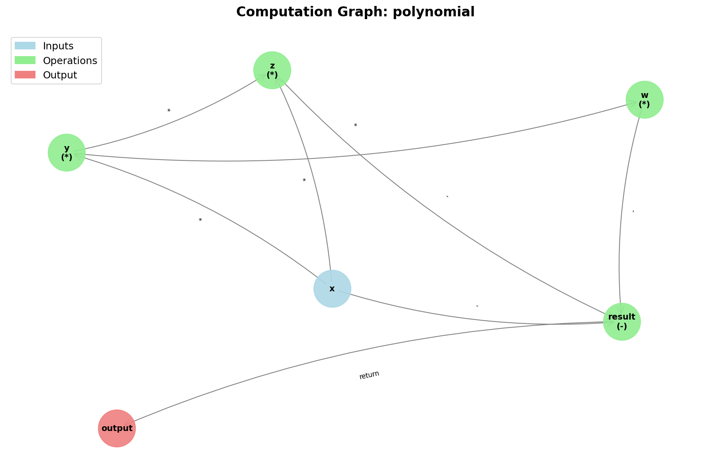

# Tangent - Source-to-Source Automatic Differentiation

[](https://www.python.org/downloads/)
[](https://github.com/pedronahum/tangent/actions/workflows/ci.yml)
[](tests/)
[](https://opensource.org/licenses/Apache-2.0)
[](https://colab.research.google.com/github/pedronahum/tangent/blob/master/notebooks/tangent_tutorial.ipynb)

**A Python library for automatic differentiation that generates readable, inspectable gradient code — with NumPy, JAX, TensorFlow, PyTorch, and Keras 3 support.**

Originally developed by Google Research, now maintained and enhanced by [@pedronahum](https://github.com/pedronahum).

<p align="center">
  
  <br>
  <em>Visualize how gradients flow through your computations</em>
</p>

---

## 🌟 What Makes Tangent Unique?

Tangent performs **source-to-source** automatic differentiation: it transforms your Python code directly into gradient code that you can read, debug, and understand. Unlike black-box autodiff libraries:

- **📖 Readable**: Generated gradient code is pure Python you can inspect
- **🔍 Debuggable**: Step through gradient computation line by line
- **🎨 Visual**: Interactive computation graphs and gradient flow diagrams
- **🔧 Flexible**: One API across NumPy, JAX, TensorFlow, PyTorch, and Keras 3 (any backend)
- **🐍 Pythonic**: Control flow, closures, classes, comprehensions, and second derivatives


```python
import tangent

def f(x):
    return x ** 3 - 2 * x ** 2 + 3 * x - 1

df = tangent.grad(f, verbose=1)   # prints the generated gradient code
print(df(2.0))                    # f'(2) = 11.0
```

---

## 🚀 Quick Start

### Installation

```bash
# Core (NumPy gradients)
pip install git+https://github.com/pedronahum/tangent.git

# Optional backends are installed as extras:
pip install "tangent[jax]"        # JAX support
pip install "tangent[tf]"         # TensorFlow support
pip install "tangent[torch]"      # PyTorch support
pip install "tangent[keras]"      # Keras 3 (backend-agnostic keras.ops)
pip install "tangent[viz]"        # matplotlib + networkx visualization
pip install "tangent[symbolic]"   # SymPy-based algebraic optimizations
pip install "tangent[all]"        # everything above, plus pytest
```

Python 3.9–3.13 are supported and tested in CI. Note the platform caveats in
[Backend Support](#-backend-support) (e.g. TensorFlow has no CUDA build for
aarch64).

### Basic Usage

```python
import tangent
import numpy as np

def f(x):
    return x ** 3 - 2 * x ** 2 + 3 * x - 1

df = tangent.grad(f)
print(df(2.0))   # 11.0
```

### Multi-Backend Usage

The same `tangent.grad` API differentiates code written against any supported
array library:

```python
# NumPy
def f_np(x):
    return np.sum(x ** 2)

# JAX
def f_jax(x):
    return jnp.sum(jnp.tanh(x))

# TensorFlow
def f_tf(x):
    return tf.reduce_sum(tf.tanh(x))

# PyTorch
def f_torch(x):
    return torch.sum(torch.tanh(x))

# Keras 3 — works with whichever Keras backend is active
def f_keras(x):
    return kops.sum(kops.tanh(x))

for f in (f_np, f_jax, f_tf, f_torch, f_keras):
    df = tangent.grad(f)
```

Each backend extension registers adjoints (reverse mode) and, for most ops,
forward-mode tangents; see the per-extension lists in
[Backend Support](#-backend-support).

---

## 🖥️ Backend Support

| Backend | Module | Reverse-mode adjoints | Forward-mode tangents | Notes |
|---|---|---|---|---|
| NumPy | `tangent/grads.py` + `numpy_extended.py` | 80+ | 50+ | Core gradients plus extended ops (matmul, reductions, statistics, shape ops) |
| JAX | `tangent/jax_extensions.py` | 50+ | 45+ | `jax.numpy` ops and `jax.nn` activations; JAX is the reference for second-order tests |
| TensorFlow 2.x | `tangent/tf_extensions.py` + `tf_extended.py` | 45+ | 20+ | Eager-mode TF; includes conv/pooling, linalg, and reductions |
| PyTorch | `tangent/torch_extensions.py` | 45+ | 30+ | Functional `torch.*` API, verified against `torch.autograd` |
| Keras 3 | `tangent/keras_extensions.py` | 35+ | ~20 | Backend-agnostic `keras.ops`; runs on the TF, JAX, or torch backend |

Backend notes worth knowing:

- **Optional by design** — extensions load when the backend is importable and
  warn (not fail) otherwise. Core NumPy autodiff always works.
- **Keras backend choice** — `keras.ops` gradients run on whichever backend
  Keras is configured with (`KERAS_BACKEND=tensorflow|jax|torch`). Verified
  with the TensorFlow and JAX backends; the torch backend works in
  torch-only environments, but importing TensorFlow and torch in one process
  can crash on some platforms (e.g. aarch64/GB10) — a platform issue, not a
  Tangent one.
- **TensorFlow seeds** — pass an explicit seed matching your tensor dtype
  (e.g. `df(x, tf.constant(1.0, dtype=x.dtype))`); TF does not implicitly mix
  float64 Python-float seeds with float32 tensors.
- **Aliases** — torch aliases (`torch.negative`/`subtract`/`multiply`/`divide`)
  are registered alongside the short names.

A shared cross-backend test suite (`tests/test_backend_coverage.py`) runs one
op catalog — arithmetic, exp/log, trig, activations, reductions, matmul,
reshape, transpose — through every installed backend and checks the results
against analytic gradients, keeping all five extensions at the same coverage
bar.

---

## 🎨 Gallery of Gradients: See the Magic

**The killer feature: readable gradient code.** [](https://colab.research.google.com/github/pedronahum/tangent/blob/master/examples/Gallery_of_Gradients.ipynb)

Unlike black-box autodiff libraries, Tangent shows you **exactly** how gradients are computed. The gallery walks through 8 examples:

- 🔢 Polynomial derivatives (chain rule basics)
- 🔄 For loops that run **in reverse** during backprop
- 🌀 While loops with stack-based tape recording
- 🔀 Conditional branching (if/else and ternaries)
- 📊 NumPy array operations and broadcasting
- 📦 Nested function inlining
- 🔢 Matrix operations with colon slicing
- ⚡ Optimization comparison (before/after)

Each example shows: **original function → generated gradient code → why it looks that way → verification**.

**[→ Explore the Gallery](https://colab.research.google.com/github/pedronahum/tangent/blob/master/examples/Gallery_of_Gradients.ipynb)** | [📖 Documentation](examples/README_GALLERY.md)

---

## 🚀 Real-World Example: Building Energy Optimization

[](https://colab.research.google.com/github/pedronahum/tangent/blob/master/examples/Building_Energy_Optimization_with_Tangent.ipynb)

Optimize building heating to minimize energy costs — a real-world differentiable simulation.

> **Based on**: PassiveLogic's [Breaking the AI Speed Barrier](https://passivelogic.com/blog/?post=breaking-ai-speed-barrier-blog) and their [Differentiable Swift Examples](https://github.com/PassiveLogic/differentiable-swift-examples/tree/main/Benchmarks/BuildingSimulation). This example demonstrates how Tangent achieves similar performance in Python.

```python
import tangent

# Physical simulation: building temperature dynamics
def simulate_building(heating_schedule, outdoor_temp, electricity_price, params):
    T = params['T_initial']
    total_cost = 0.0
    for t in range(len(heating_schedule)):
        dT_dt = (outdoor_temp[t] - T) / (params['R'] * params['C']) + \
                heating_schedule[t] / params['C']
        T = T + params['dt'] * dT_dt
        total_cost += electricity_price[t] * heating_schedule[t] + \
                     params['lambda_comfort'] * (T - params['T_target']) ** 2
    return total_cost

# 🎯 Automatic differentiation — one line
grad_simulate = tangent.grad(simulate_building, optimized=True)
gradient = grad_simulate(heating_schedule, outdoor_temp, electricity_price, params)
```

**[→ Open Interactive Notebook](https://colab.research.google.com/github/pedronahum/tangent/blob/master/examples/Building_Energy_Optimization_with_Tangent.ipynb)**

---

## 🐍 Python Feature Support

Tangent supports a broad subset of Python for numerical computing:

- **Control flow**: `if`/`elif`/`else`, `for` loops (with `range`/`enumerate`/`zip`), `while` loops, ternary expressions
- **Operators**: arithmetic, comparisons, boolean (`and`, `or`, `not`), augmented assignment (`+=`, `-=`, `*=`, `/=`, `**=`)
- **Functions**: lambdas, closures and factories, nested calls, default/keyword arguments
- **Classes**: user-defined classes with method inlining, instance attributes, method chaining, inheritance and `super()`
- **Data**: NumPy arrays; **pytree arguments** — tuples, lists and (nested) dicts of arrays can be passed as arguments and indexed/looped, with gradients returned in the same structure; list comprehensions
- **Statements**: `assert`, `pass`, early `return`
- **Higher-order**: `grad(grad(f))` second derivatives, Hessian-vector products

**📖 Complete reference with examples**: [Python Feature Support Guide](docs/features/PYTHON_FEATURE_SUPPORT.md) — plus 16 focused feature docs under [`docs/features/`](docs/features/).

Not supported: `break`/`continue`, `@property`/`@classmethod`/`@staticmethod`, generators, and in-place array mutation through augmented subscript assignment. See the feature guide for the full list.

---

## ⚡ Advanced Optimization Pipeline

`tangent.grad(f, optimized=True)` runs a multi-pass optimization pipeline that produces production-grade gradient code:

1. **Constant folding** — evaluate constant expressions at compile time
2. **Dead code elimination** — activity analysis + backward slicing remove unused computation (typically 30–50% of generated code)
3. **Assignment propagation** — inline single-use variables
4. **Strength reduction** — `x ** 2` → `x * x`, `x / c` → `x * (1/c)`
5. **Common subexpression elimination** — reuse repeated subexpressions
6. **Algebraic simplification** — SymPy-based identities (`sin² + cos² → 1`)
7. **Fixed-point iteration** — repeat until stable

**Measured impact** on the building-energy example: **2.35×** end-to-end with the full pipeline (1.95× from DCE alone).

```python
df = tangent.grad(f, optimized=True)          # production
df = tangent.grad(f, optimized=False)         # all intermediate steps (education/debugging)
df = tangent.grad(f, optimized=True, verbose=1)  # prints what each pass did
```

**Deep dives**: [Symbolic Optimizations](docs/optimizations/SYMBOLIC_OPTIMIZATIONS_COMPLETE.md) · [Strength Reduction](docs/optimizations/STRENGTH_REDUCTION_COMPLETE.md) · [Performance Analysis](docs/optimizations/PERFORMANCE_ANALYSIS.md) · [Straight-Line Coarsening](docs/optimizations/COARSENING.md) · [DCE implementation](tangent/optimizations/dce.py)

### Straight-line coarsening (opt-in)

A different, symbolic strategy is available for hot straight-line kernels.
Instead of emitting one adjoint statement (and one tape push/pop) per
primitive op, Tangent lifts the whole segment into a single SymPy expression,
differentiates it once, and emits a compact vector-Jacobian product:

```python
df = tangent.grad(f, optimizations={'coarsening': True})
```

For a small straight-line kernel the difference is dramatic — the per-op
reverse pass emits dozens of adjoint statements and tape pushes, while
coarsening emits one compact VJP:

```python
def kernel(a, b, c):
    return (np.exp(np.sin(a * b)) + c) * a

# Coarsened adjoint (auto-generated):
#   ba = bret * (c + a*b*cos(a*b)*exp(sin(a*b)) + exp(sin(a*b)))
#   bb = bret * a**2 * cos(a*b) * exp(sin(a*b))
#   bc = a * bret
```

It currently coarsens the elementwise ops `sin, cos, tan, exp, log, sqrt,
arcsin, arccos, arctan` (and `+ - * / **`). It is a prototype and
deliberately conservative: it only applies to reverse-mode gradients of pure
straight-line segments of NumPy elementwise arithmetic. Anything else —
control flow, reductions such as `np.sum`, non-NumPy backends
(JAX/PyTorch/TensorFlow/Keras), varargs, multi-output configurations, or
`preserve_result` — transparently falls back to the standard pipeline, so
enabling it never changes correctness. Requires the `symbolic` extra
(`pip install "tangent[symbolic]"`). See
[tangent/optimizations/coarsening.py](tangent/optimizations/coarsening.py),
[docs/optimizations/COARSENING.md](docs/optimizations/COARSENING.md), and the
worked demo in [`examples/recent_features.py`](examples/recent_features.py).

---

## 🎨 Visualization Tools

Interactive tools for understanding autodiff (install with `pip install "tangent[viz]"`):

| Tool | What it shows |
|---|---|
| `tangent.visualize(f, mode='graph')` | Computation graph: inputs, operations, output |
| `tangent.visualize(f, mode='flow', inputs=(2.0,))` | Forward values + backward gradient propagation |
| `tangent.compare_gradients(f, (x,))` | Autodiff vs numerical gradients, side by side |
| `tangent.show_gradient_code(f)` | Pretty-printed original + generated gradient code |

```python
import tangent
import matplotlib.pyplot as plt

def f(x):
    return x * x + 2.0 * x + 1.0

fig = tangent.visualize(f, mode='flow', inputs=(2.0,))
plt.show()
```



Run `python examples/demo_visualization.py` to generate the full set of demo plots.

---

## 🔬 Advanced Features

### Multiple gradients

```python
def f(x, y):
    return x * x * y + x * y * y

df = tangent.grad(f, wrt=(0, 1))
grad_x, grad_y = df(2.0, 3.0)   # ∂f/∂x = 21.0, ∂f/∂y = 16.0
```

### Preserve results

```python
df = tangent.grad(f, preserve_result=True)
gradient, result = df(x)   # both the gradient and the primal value
```

### Forward and reverse mode

```python
df_rev = tangent.grad(f)                          # reverse mode (default)
df_fwd = tangent.autodiff(f, mode='forward')      # forward mode
```

### Second derivatives

```python
def f(x):
    return x ** 3

ddf = tangent.grad(tangent.grad(f))
print(ddf(2.0))   # 12.0  (d²/dx² x³ = 6x)
```

Second derivatives work in both optimized and unoptimized modes, including
through loops and across backends. See [Known Limitations](#-known-limitations)
for the tape-API caveat.

### Automatic caching

Compiled gradient functions are cached per (source, transform options), so
repeated `tangent.grad(f)` calls are orders of magnitude faster than the
first compilation. Inspect with `tangent.get_cache_stats()`.

---

## ⚠️ Known Limitations

Documented honestly — see [Python Feature Support](docs/features/PYTHON_FEATURE_SUPPORT.md) for details:

- **Optimized second derivatives through the low-level tape API**: functions
  that call `tangent.push`/`pop`/`Stack` directly differentiate correctly at
  first order and in *unoptimized* second order; with `optimized=True` the
  optimization passes can corrupt the result. Ordinary code never calls these
  primitives directly.
- **`break`/`continue`** are rejected at transform time.
- **Containers as function arguments (pytrees)**: tuples, lists and dicts of
  arrays can be passed as arguments and indexed/looped for first-order
  gradients. **Returning** a container is not yet supported, and neither are
  second derivatives through container arguments (`tangent.seed_pytree` /
  `tangent.match_seed` are the building blocks toward that).
- **TF seed dtype** — see [Backend Support](#-backend-support).
- **`jnp.concatenate`/`jnp.stack`** differentiate when given a list literal, or
  a variable assigned exactly once to a literal and never mutated; dynamically
  built lists raise `NotImplementedError`.

---

## 📖 Examples

### Linear regression

```python
import tangent
import numpy as np

X = np.random.randn(100, 1)
y = 3 * X + 2 + np.random.randn(100, 1) * 0.5

def mse_loss(w, b):
    return np.mean((w * X + b - y) ** 2)

dmse_dw = tangent.grad(mse_loss, wrt=(0,))
dmse_db = tangent.grad(mse_loss, wrt=(1,))

w, b, lr = 0.0, 0.0, 0.1
for epoch in range(50):
    w -= lr * dmse_dw(w, b)
    b -= lr * dmse_db(w, b)
```

### Neural network with JAX

```python
import tangent
import jax.numpy as jnp
import jax

def neural_network(W1, b1, W2, b2, X, y):
    hidden = jax.nn.relu(jnp.dot(X, W1) + b1)
    output = jax.nn.sigmoid(jnp.dot(hidden, W2) + b2)
    return -jnp.mean(y * jnp.log(output) + (1 - y) * jnp.log(1 - output))

dnn_dW1 = tangent.grad(neural_network, wrt=(0,))
# ... one grad per parameter; use in your training loop
```

### Runnable scripts

See [`examples/`](examples/README.md) for self-contained, runnable demos. The
best starting point is **[`examples/recent_features.py`](examples/recent_features.py)**,
which showcases coarsening, pytree arguments, multi-backend gradients,
differentiable concat/stack, and second derivatives in one script:

```bash
python examples/recent_features.py
```

### Notebooks

- [Tangent Tutorial](https://colab.research.google.com/github/pedronahum/tangent/blob/master/notebooks/tangent_tutorial.ipynb) — general introduction
- [Gallery of Gradients](https://colab.research.google.com/github/pedronahum/tangent/blob/master/examples/Gallery_of_Gradients.ipynb) — readable-code showcase
- [Building Energy Optimization](https://colab.research.google.com/github/pedronahum/tangent/blob/master/examples/Building_Energy_Optimization_with_Tangent.ipynb) — real-world application

---

## 🧪 Testing

The suite covers core autodiff, every Python feature, all five backends, and
second derivatives. The cross-backend catalog is checked two ways: against
hand-derived analytic gradients **and** against an independent
finite-difference oracle, so newly added adjoints are verified automatically:

```bash
pytest tests/                        # core suite (no backends required)
pytest tests/test_backend_coverage.py  # cross-backend op catalog (+ FD oracle)
pytest tests/test_coarsening.py      # straight-line coarsening
pytest tests/test_torch.py           # PyTorch-specific tests
pytest tests/test_keras.py           # Keras tests (any backend)
```

Current status: **77,000+ parameterized test cases pass** (0 failures). The 21
expected failures (`xfail`) are documented limitations: the low-level tape API
under optimized higher-order differentiation, and higher-order differentiation
through container arguments. CI runs the suite on Python 3.9–3.13 and exercises
the cross-backend catalog against every installed backend.

---

## 📊 Repository Structure

```
tangent/
├── tangent/                      # Core library
│   ├── grad_util.py              # Main autodiff engine (grad/autodiff/vjp/jvp)
│   ├── reverse_ad.py             # Reverse-mode transformation
│   ├── forward_ad.py             # Forward-mode transformation
│   ├── grads.py                  # Core NumPy adjoints (57)
│   ├── tangents.py               # Core forward-mode tangents (53)
│   ├── numpy_extended.py         # Extended NumPy adjoints (26)
│   ├── jax_extensions.py         # JAX adjoints + tangents
│   ├── tf_extensions.py          # TensorFlow adjoints + tangents
│   ├── tf_extended.py            # Extended TensorFlow adjoints
│   ├── torch_extensions.py       # PyTorch adjoints + tangents
│   ├── keras_extensions.py       # Keras 3 (backend-agnostic) adjoints + tangents
│   ├── class_desugar.py          # Class method inlining
│   ├── visualization.py          # Visualization tools
│   ├── function_cache.py         # Gradient-function caching
│   ├── optimizations/            # DCE, CSE, strength reduction, algebraic
│   ├── analysis/                 # Activity analysis, checkpoint analysis
│   └── checkpointing/            # Gradient checkpointing
├── tests/                        # 69 test modules (75k+ cases)
│   ├── test_backend_coverage.py  # Cross-backend op catalog
│   ├── test_torch.py             # PyTorch tests
│   ├── test_keras.py             # Keras tests
│   ├── test_jax.py               # JAX tests
│   ├── test_tensorflow.py        # TensorFlow tests
│   └── ...                       # Feature and engine tests
├── examples/                     # Scripts and notebooks
├── notebooks/                    # Interactive tutorials
├── benchmarks/                   # Performance benchmarks
└── docs/                         # Feature/optimization/benchmark docs
```

---

## 📚 Documentation

- **[→ Full Documentation Index](docs/INDEX.md)**
- **[Python Feature Support](docs/features/PYTHON_FEATURE_SUPPORT.md)** — the definitive feature reference
- **[Framework Comparison](docs/benchmarks/FRAMEWORK_COMPARISON.md)** — Tangent vs TensorFlow vs PyTorch benchmarks
- **[Optimizations](docs/optimizations/)** — CSE, strength reduction, performance analysis
- **[Checkpointing User Guide](docs/checkpointing_user_guide.md)** — gradient checkpointing

---

## 🤝 Contributing

Contributions are welcome! See [CONTRIBUTING.md](CONTRIBUTING.md). Good starting points:

- Additional gradient definitions (extend any backend module + the cross-backend catalog)
- The open items in [Known Limitations](#-known-limitations)
- Documentation improvements

1. Fork the repository
2. Create a feature branch
3. Add tests for your changes (`pytest tests/` must stay green)
4. Submit a pull request

---

## 📝 License

Apache License 2.0 — see [LICENSE](LICENSE).

Original work Copyright 2017 Google Inc.
Modified work Copyright 2024–2026 Pedro Nahum

---

## 🙏 Acknowledgments

- Original Tangent library by Google Research
- The JAX, TensorFlow, and PyTorch teams for the numerical computing ecosystems
- The Python scientific computing community

---

## 📬 Contact

- **Repository**: [github.com/pedronahum/tangent](https://github.com/pedronahum/tangent)
- **Issues**: [github.com/pedronahum/tangent/issues](https://github.com/pedronahum/tangent/issues)
- **Author**: [@pedronahum](https://github.com/pedronahum)

---

**Built with ❤️ for the machine learning and scientific computing communities**
